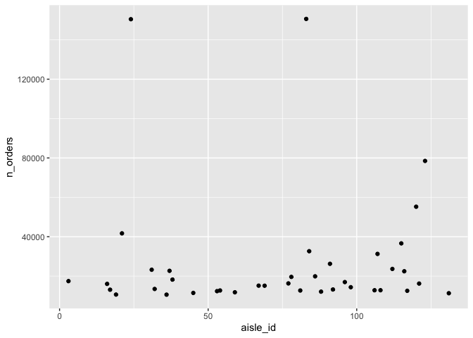
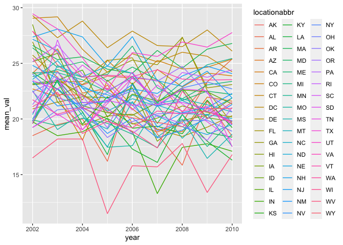

p8105_hw3_pt2632
================
2023-10-06

``` r
library(tidyverse)
```

    ## ── Attaching core tidyverse packages ──────────────────────── tidyverse 2.0.0 ──
    ## ✔ dplyr     1.1.3     ✔ readr     2.1.4
    ## ✔ forcats   1.0.0     ✔ stringr   1.5.0
    ## ✔ ggplot2   3.4.3     ✔ tibble    3.2.1
    ## ✔ lubridate 1.9.3     ✔ tidyr     1.3.0
    ## ✔ purrr     1.0.2     
    ## ── Conflicts ────────────────────────────────────────── tidyverse_conflicts() ──
    ## ✖ dplyr::filter() masks stats::filter()
    ## ✖ dplyr::lag()    masks stats::lag()
    ## ℹ Use the conflicted package (<http://conflicted.r-lib.org/>) to force all conflicts to become errors

``` r
library(p8105.datasets)
```

# Problem 1

``` r
# load dataset
data("instacart")
```

## Data Description

There are 15 variables and 1384617 in this datasest.

structure of the data, describing some key variables, and giving
illstrative examples of observations

## Answers to Questions

1.  How many aisles are there, and which aisles are the most items
    ordered from?

``` r
length(unique(pull(instacart, aisle_id)))
```

    ## [1] 134

``` r
instacart |> 
  group_by(aisle_id) |> 
  summarize(n_orders = n()) |>
  mutate(max_order = max(n_orders)) |>
  filter(n_orders == max_order) |>
  pull(aisle_id)
```

    ## [1] 83

2.  Make a plot that shows the number of items ordered in each aisle,
    limiting this to aisles with more than 10000 items ordered. Arrange
    aisles sensibly, and organize your plot so others can read it.

``` r
# Make a plot that shows the number of items ordered in each aisle, limiting this to aisles with more than 10000 items ordered
instacart |> 
  group_by(aisle_id) |> 
  summarize(n_orders = n()) |>
  filter(n_orders > 10000) |>
  arrange(aisle_id) |>
  ggplot(aes(aisle_id, n_orders)) + geom_point()
```

<!-- -->

3.  Make a table showing the three most popular items in each of the
    aisles “baking ingredients”, “dog food care”, and “packaged
    vegetables fruits”. Include the number of times each item is ordered
    in your table.

``` r
instacart |>
  filter(aisle == "baking ingredients" | 
         aisle == "dog food care" | 
         aisle == "packaged vegetables fruits") |>
  group_by(aisle, product_id) |>
  summarize(order_count = n(), .groups = "drop_last") |>
  mutate(rnk = min_rank(desc(order_count))) |>
  filter(rnk < 4) |>
  arrange(aisle, rnk) |> 
  # knit as table
  knitr::kable(digits = 2)
```

| aisle                      | product_id | order_count | rnk |
|:---------------------------|-----------:|------------:|----:|
| baking ingredients         |      23537 |         499 |   1 |
| baking ingredients         |      23405 |         387 |   2 |
| baking ingredients         |      49533 |         336 |   3 |
| dog food care              |        722 |          30 |   1 |
| dog food care              |      23329 |          28 |   2 |
| dog food care              |      17471 |          26 |   3 |
| packaged vegetables fruits |      21903 |        9784 |   1 |
| packaged vegetables fruits |      27966 |        5546 |   2 |
| packaged vegetables fruits |      39275 |        4966 |   3 |

4.  Make a table showing the mean hour of the day at which Pink Lady
    Apples and Coffee Ice Cream are ordered on each day of the week;
    format this table for human readers (i.e. produce a 2 x 7 table).

``` r
instacart |> 
  filter(product_name == "Pink Lady Apples" |
         product_name == "Coffee Ice Cream") |>
  group_by(product_name, order_dow) |>
  summarize(mean_order_hour = mean(order_hour_of_day), .groups = "drop_last") |>
  pivot_wider(names_from = order_dow, values_from = mean_order_hour) |>
  # knit as table
  knitr::kable(digits = 2)
```

| product_name     |     0 |     1 |     2 |     3 |     4 |     5 |     6 |
|:-----------------|------:|------:|------:|------:|------:|------:|------:|
| Coffee Ice Cream | 13.77 | 14.32 | 15.38 | 15.32 | 15.22 | 12.26 | 13.83 |
| Pink Lady Apples | 13.44 | 11.36 | 11.70 | 14.25 | 11.55 | 12.78 | 11.94 |

# Problem 2

``` r
# load dataset
data("brfss_smart2010")
```

## Data Cleaning

``` r
ordered_response <- c("Poor", "Fair", "Good", "Very good", "Excellent")
cleaned_brfss <- brfss_smart2010 |> 
  janitor::clean_names() |>
  # select topic "Overall Health"
  filter(topic == "Overall Health",
         # select response from “Excellent” to “Poor”
         response %in% ordered_response) |>
  # Order response from "Poor" to "Excellent"
  mutate(response = factor(response, levels = ordered_response))
```

## Answers to Questions

1.  In 2002, which states were observed at 7 or more locations? What
    about in 2010?

``` r
cleaned_brfss |>
  filter(year == 2002) |>
  group_by(locationabbr) |>
  # !!!!!!!!!!!!!!! unique ???
  summarize(n_location = n()) |>
  filter(n_location >= 7)
```

    ## # A tibble: 36 × 2
    ##    locationabbr n_location
    ##    <chr>             <int>
    ##  1 AZ                   10
    ##  2 CO                   20
    ##  3 CT                   35
    ##  4 DE                   15
    ##  5 FL                   35
    ##  6 GA                   15
    ##  7 HI                   20
    ##  8 ID                   10
    ##  9 IL                   15
    ## 10 IN                   10
    ## # ℹ 26 more rows

``` r
cleaned_brfss |>
  filter(year == 2010) |>
  group_by(locationabbr) |>
  # !!!!!!!!!!!!!!! unique ???
  summarize(n_location = n()) |>
  filter(n_location >= 7)
```

    ## # A tibble: 45 × 2
    ##    locationabbr n_location
    ##    <chr>             <int>
    ##  1 AL                   15
    ##  2 AR                   15
    ##  3 AZ                   15
    ##  4 CA                   60
    ##  5 CO                   35
    ##  6 CT                   25
    ##  7 DE                   15
    ##  8 FL                  205
    ##  9 GA                   20
    ## 10 HI                   20
    ## # ℹ 35 more rows

2.  Construct a dataset that is limited to `Excellent` responses, and
    contains, year, state, and a variable that averages the `data_value`
    across locations within a state. Make a “spaghetti” plot of this
    average value over time within a state (that is, make a plot showing
    a line for each state across years – the `geom_line` geometry and
    `group` aesthetic will help).

``` r
cleaned_brfss |> 
  # !!!!!!!!!!! filter NA ?
  filter(response == "Excellent" & !is.na(data_value)) |>
  group_by(year, locationabbr) |>
  summarize(mean_val = mean(data_value), .groups = "drop_last") |>
  ggplot(aes(x = year, y = mean_val)) + geom_line(aes(color = locationabbr, group = locationabbr))
```

<!-- -->

3.  Make a two-panel plot showing, for the years 2006, and 2010,
    distribution of `data_value` for responses (“Poor” to “Excellent”)
    among locations in NY State.

``` r
cleaned_brfss |>
  filter(year == 2006 | year == 2010 & !is.na(data_value)) |>
  ggplot(aes(x = data_value, fill = response)) +
  geom_density(alpha = .5) +
  facet_grid(year ~ .)
```

    ## Warning: Removed 4 rows containing non-finite values (`stat_density()`).

<!-- -->

# Problem 3

``` r
acc <- tibble(read.csv("./datasets/nhanes_accel.csv"))
covar <- tibble(read.csv("./datasets/nhanes_covar.csv", skip = 4))
```

## Data Manipulation

Load, tidy, merge, and otherwise organize the data sets. Your final
dataset should include all originally observed variables; exclude
participants less than 21 years of age, and those with missing
demographic data; and encode data with reasonable variable classes
(i.e. not numeric, and using factors with the ordering of tables and
plots in mind).

``` r
data <- 
  left_join(covar, acc, by = join_by(SEQN == SEQN)) |>
  filter(age >= 21 & !is.na(sex) & !is.na(age) & !is.na(BMI) & !is.na(education)) |>
  mutate(sex = factor(
    case_match(sex, 1 ~ "male", 2 ~ "female"), 
    levels = c("male", "female")), 
         education = factor(
           case_match(education, 
                      1 ~ "Less than high school",
                      2 ~ "High school equivalent", 
                      3 ~ "More than high school"), 
           levels = c("Less than high school", "High school equivalent", "More than high school"))
)
```

## Answers to Questions

1.  Produce a reader-friendly table for the number of men and women in
    each education category, and create a visualization of the age
    distributions for men and women in each education category. Comment
    on these items.

``` r
data |> 
  group_by(sex, education) |> 
  summarize(count = n(), .groups = "drop_last") |> 
  # knit as table
  knitr::kable(digits = 0)
```

| sex    | education              | count |
|:-------|:-----------------------|------:|
| male   | Less than high school  |    27 |
| male   | High school equivalent |    35 |
| male   | More than high school  |    56 |
| female | Less than high school  |    28 |
| female | High school equivalent |    23 |
| female | More than high school  |    59 |

2.  Traditional analyses of accelerometer data focus on the total
    activity over the day. Using your tidied dataset, aggregate across
    minutes to create a total activity variable for each participant.
    Plot these total activities (y-axis) against age (x-axis); your plot
    should compare men to women and have separate panels for each
    education level. Include a trend line or a smooth to illustrate
    differences. Comment on your plot.

3.  Accelerometer data allows the inspection activity over the course of
    the day. Make a three-panel plot that shows the 24-hour activity
    time courses for each education level and use color to indicate sex.
    Describe in words any patterns or conclusions you can make based on
    this graph; including smooth trends may help identify differences.
