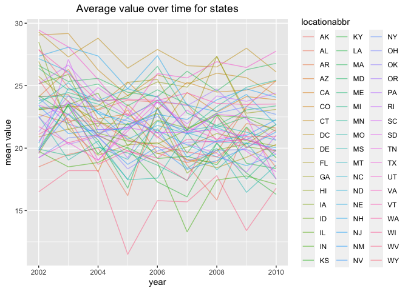
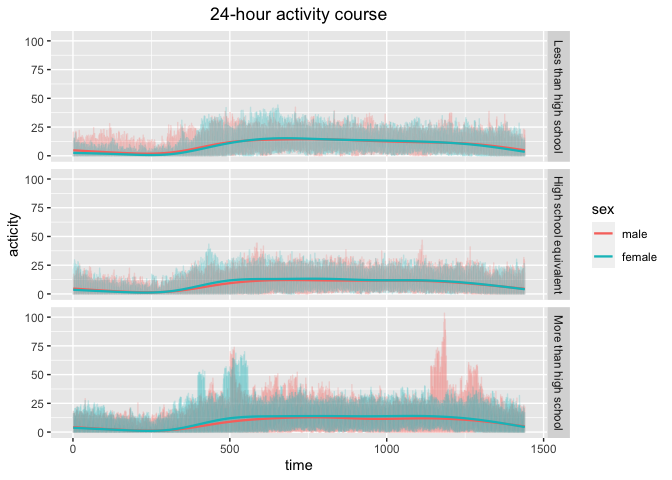

p8105_hw3_pt2632
================
2023-10-06

``` r
library(tidyverse)
```

    ## ── Attaching core tidyverse packages ──────────────────────── tidyverse 2.0.0 ──
    ## ✔ dplyr     1.1.3     ✔ readr     2.1.4
    ## ✔ forcats   1.0.0     ✔ stringr   1.5.0
    ## ✔ ggplot2   3.4.3     ✔ tibble    3.2.1
    ## ✔ lubridate 1.9.3     ✔ tidyr     1.3.0
    ## ✔ purrr     1.0.2     
    ## ── Conflicts ────────────────────────────────────────── tidyverse_conflicts() ──
    ## ✖ dplyr::filter() masks stats::filter()
    ## ✖ dplyr::lag()    masks stats::lag()
    ## ℹ Use the conflicted package (<http://conflicted.r-lib.org/>) to force all conflicts to become errors

``` r
library(p8105.datasets)
```

# Problem 1

``` r
# load dataset
data("instacart")
```

## Data Description

There are 15 variables and 1384617 in this dataset.

Structure of the data: 2-d dataframe

Key variables:  
- `order_id`: order identifier

- `product_id`: product identifier

- `add_to_cart_order`: order in which each product was added to cart

- `reordered`: 1 = this prodcut has been ordered by this user in the
  past, 0 = otherwise

- `user_id`: customer identifier

- `eval_set`: which evaluation set this order belongs in (Note that the
  data for use in this class is exclusively from the “train” eval_set)

- `order_number`: the order sequence number for this user (1=first,
  n=nth)

- `order_dow`: the day of the week on which the order was placed

- `order_hour_of_day`: the hour of the day on which the order was placed

- `days_since_prior_order`: days since the last order, capped at 30, NA
  if order_number=1

- `product_name`: name of the product

- `aisle_id`: aisle identifier

- `department_id`: department identifier

- `aisle`: the name of the aisle

- `department`: the name of the department

Illustrative examples of observation:

For 4-th order (order_id: 1) of customer (user_id: 112108), there is a
Bulgarian Yogurt(product_id: 49302) placed as the 1-th item in the cart.
It was ordered by this customer in past and the last order of this
customer was placed on 9 days before. This slice of data comes from
“train” evaluation set. The placed time of this item is in 10-th hour on
the 5-th day in a week. And this product is transported from the dairy
eggs department (department_id: 16) of yogurt aisle (aisle_id: 120).

## Answers to Questions

1.  How many aisles are there, and which aisles are the most items
    ordered from?

There are 134 aisles in total. The aisle with id 83 are the aisle with
most order items.

2.  Make a plot that shows the number of items ordered in each aisle,
    limiting this to aisles with more than 10000 items ordered. Arrange
    aisles sensibly, and organize your plot so others can read it.

``` r
slice1 <- instacart |> 
  # group operation
  group_by(aisle_id) |> 
  # calculate order count of each aisle
  summarize(n_orders = n()) |>
  # select the aisle with more than 10000 ordered items
  filter(n_orders > 10000) |>
  # arrange aisle
  arrange(aisle_id)
  # scatter point plot of "order counts" over "aisle id"
  ggplot(slice1, aes(aisle_id, n_orders)) + geom_point(alpha = .4) +
  labs(
    title = "Order count in aisle", 
    x = "aisle id", 
    y = "order count") +
  theme(plot.title = element_text(hjust = 0.5))
```

<!-- -->

Comments: There are 39 aisles with more than 10000 item ordered. 2 of
them have more than 120000 item ordered, 3 aisle’s ordered items count
between 40000 and 80000. And the rest of them are with less than 40000
ordered items.

3.  Make a table showing the three most popular items in each of the
    aisles “baking ingredients”, “dog food care”, and “packaged
    vegetables fruits”. Include the number of times each item is ordered
    in your table.

``` r
instacart |>
  # filter entry from specific aisle
  filter(aisle == "baking ingredients" | 
         aisle == "dog food care" | 
         aisle == "packaged vegetables fruits") |>
  # group operation
  group_by(aisle, product_id) |>
  # calculate the count of ordered item of specific aisle
  summarize(order_count = n(), .groups = "drop_last") |>
  # calculate the rank of order count in decreasing order
  mutate(rnk = min_rank(desc(order_count))) |>
  # filter the 3 most popular products of specific aisle 
  filter(rnk < 4) |>
  # arrange data
  arrange(aisle, rnk) |> 
  # knit as table
  knitr::kable(digits = 2)
```

| aisle                      | product_id | order_count | rnk |
|:---------------------------|-----------:|------------:|----:|
| baking ingredients         |      23537 |         499 |   1 |
| baking ingredients         |      23405 |         387 |   2 |
| baking ingredients         |      49533 |         336 |   3 |
| dog food care              |        722 |          30 |   1 |
| dog food care              |      23329 |          28 |   2 |
| dog food care              |      17471 |          26 |   3 |
| packaged vegetables fruits |      21903 |        9784 |   1 |
| packaged vegetables fruits |      27966 |        5546 |   2 |
| packaged vegetables fruits |      39275 |        4966 |   3 |

Comments: The top 3 popular items in “baking ingredients” aisle is the
item with id 23537, 23405 and 49533. The top 3 popular items in “dog
food care” aisle is the item with id 722, 23329 and 17471. The top 3
popular items in “packaged vegetables fruits” aisle is the item with id
21903, 27966 and 39275.

4.  Make a table showing the mean hour of the day at which Pink Lady
    Apples and Coffee Ice Cream are ordered on each day of the week;
    format this table for human readers (i.e. produce a 2 x 7 table).

``` r
instacart |> 
  # filter the specific product
  filter(product_name == "Pink Lady Apples" |
         product_name == "Coffee Ice Cream") |>
  # group operation
  group_by(product_name, order_dow) |>
  # calculate the mean order hour of each product in specific day in a week
  summarize(mean_order_hour = mean(order_hour_of_day), .groups = "drop_last") |>
  # transform rows to columns
  pivot_wider(names_from = order_dow, values_from = mean_order_hour, names_prefix = "day_") |>
  # knit as table
  knitr::kable(digits = 2)
```

| product_name     | day_0 | day_1 | day_2 | day_3 | day_4 | day_5 | day_6 |
|:-----------------|------:|------:|------:|------:|------:|------:|------:|
| Coffee Ice Cream | 13.77 | 14.32 | 15.38 | 15.32 | 15.22 | 12.26 | 13.83 |
| Pink Lady Apples | 13.44 | 11.36 | 11.70 | 14.25 | 11.55 | 12.78 | 11.94 |

Comments: The average ordering hour of Coffee Ice Cream is between 12
and 16 in a week. The average ordering hour of Pink Lady Apples is
between 11 and 15 in a week.

# Problem 2

``` r
# load dataset
data("brfss_smart2010")
```

## Data Cleaning

``` r
# define level order of response
ordered_response <- c("Poor", "Fair", "Good", "Very good", "Excellent")
cleaned_brfss <- 
  brfss_smart2010 |> 
  # tidy colnames
  janitor::clean_names() |>
  # select topic "Overall Health"
  filter(topic == "Overall Health",
         # select response from “Excellent” to “Poor”
         response %in% ordered_response) |>
  # Order response from "Poor" to "Excellent"
  mutate(response = factor(response, levels = ordered_response))
```

Description: There are 10625 observations and 23 variables in the
cleaned dataset.

## Answers to Questions

1.  In 2002, which states were observed at 7 or more locations? What
    about in 2010?

``` r
cleaned_brfss |> 
  filter(year == 2002) |> 
  select(locationabbr, locationdesc) |> 
  distinct() |> 
  group_by(locationabbr) |> 
  summarize(n_location = n()) |> 
  filter(n_location >= 7) |>
  knitr::kable()
```

| locationabbr | n_location |
|:-------------|-----------:|
| CT           |          7 |
| FL           |          7 |
| MA           |          8 |
| NC           |          7 |
| NJ           |          8 |
| PA           |         10 |

In 2002, 6 states in table above were observed at 7 or more locations.

``` r
cleaned_brfss |> 
  filter(year == 2010) |> 
  select(locationabbr, locationdesc) |> 
  distinct() |> 
  group_by(locationabbr) |> 
  summarize(n_location = n()) |> 
  filter(n_location >= 7) |>
  knitr::kable()
```

| locationabbr | n_location |
|:-------------|-----------:|
| CA           |         12 |
| CO           |          7 |
| FL           |         41 |
| MA           |          9 |
| MD           |         12 |
| NC           |         12 |
| NE           |         10 |
| NJ           |         19 |
| NY           |          9 |
| OH           |          8 |
| PA           |          7 |
| SC           |          7 |
| TX           |         16 |
| WA           |         10 |

In 2010, 14 states in table above were observed at 7 or more locations.

2.  Construct a dataset that is limited to `Excellent` responses, and
    contains, year, state, and a variable that averages the `data_value`
    across locations within a state. Make a “spaghetti” plot of this
    average value over time within a state (that is, make a plot showing
    a line for each state across years – the `geom_line` geometry and
    `group` aesthetic will help).

``` r
cleaned_brfss |>
  # filter entrys with "Excellent" response
  filter(response == "Excellent") |>
  # group operation
  group_by(year, locationabbr) |>
  # calculate the mean of data_value of each group
  summarize(mean_val = mean(data_value), .groups = "drop_last") |>
  # line plot
  ggplot(aes(x = year, y = mean_val)) + 
  geom_line(aes(color = locationabbr, group = locationabbr), alpha = .5) +
  labs(
    title = "Average value over time for states", 
    x = "year", 
    y = "mean value") +
  theme(plot.title = element_text(hjust = 0.5))
```

    ## Warning: Removed 3 rows containing missing values (`geom_line()`).

<!-- -->

Comments:

The mean value of each state are fluctuating along with the time, but
all of them are between 10 and 30.

3.  Make a two-panel plot showing, for the years 2006, and 2010,
    distribution of `data_value` for responses (“Poor” to “Excellent”)
    among locations in NY State.

``` r
cleaned_brfss |>
  # filter entry from specific year
  filter(year == 2006 | year == 2010) |>
  # density plot for each response type
  ggplot(aes(x = data_value, fill = response)) +
  geom_density(alpha = .5) +
  # plot panels
  facet_grid(year ~ .) +
  labs(
    title = "Distribution of data_value", 
    x = "data_value") +
  theme(plot.title = element_text(hjust = 0.5))
```

    ## Warning: Removed 9 rows containing non-finite values (`stat_density()`).

<!-- -->

Comments:

There are no significant difference between the distribution of data
value in specific response category in 2006 and that in 2010. The data
value of people gave “Poor” response are mostly around 4, the data value
of people gave “Fair” response are mostly around 10, the data value of
people gave “Good” response are mostly around 20, the data value of
people gave “Very Good” response are mostly around 30, the data value of
people gave “Excellent” response are mostly around 36.

# Problem 3

## Data Manipulation

Load, tidy, merge, and otherwise organize the data sets. Your final
dataset should include all originally observed variables; exclude
participants less than 21 years of age, and those with missing
demographic data; and encode data with reasonable variable classes
(i.e. not numeric, and using factors with the ordering of tables and
plots in mind).

``` r
# load data
acc <- tibble(read.csv("./datasets/nhanes_accel.csv"))
covar <- tibble(read.csv("./datasets/nhanes_covar.csv", skip = 4))
```

``` r
data <- 
  # merge 2 dataset
  left_join(covar, acc, by = join_by(SEQN == SEQN)) |>
  # filter entry with age >= 21 and non-NA demographic data
  filter(age >= 21 & !is.na(sex) & !is.na(age) & !is.na(BMI) & !is.na(education)) |>
  # change variable class (numeric to factor)
  mutate(sex = factor(
    case_match(sex, 1 ~ "male", 2 ~ "female"), 
    levels = c("male", "female")), 
         education = factor(
           case_match(education, 
                      1 ~ "Less than high school",
                      2 ~ "High school equivalent", 
                      3 ~ "More than high school"), 
           levels = c("Less than high school", "High school equivalent", "More than high school"))
)
```

Description: There are 228 observations and 1445 variables in the merged
and filtered dataset.

## Answers to Questions

1.  Produce a reader-friendly table for the number of men and women in
    each education category, and create a visualization of the age
    distributions for men and women in each education category. Comment
    on these items.

``` r
data |> 
  # group operation
  group_by(sex, education) |>
  # calculate the count of entries in each group
  summarize(count = n(), .groups = "drop_last") |> 
  # knit as table
  knitr::kable(digits = 0)
```

| sex    | education              | count |
|:-------|:-----------------------|------:|
| male   | Less than high school  |    27 |
| male   | High school equivalent |    35 |
| male   | More than high school  |    56 |
| female | Less than high school  |    28 |
| female | High school equivalent |    23 |
| female | More than high school  |    59 |

Comments: The count of male participant with different education: More
than high school \> High school equivalent \> Less than high school.

The count of female participant with different education: More than high
school \> Less than high school \> High school equivalent.

``` r
data |>
  # density plot for different education levels and sex
  ggplot(aes(x = age)) + geom_density(aes(fill = sex), alpha = .4) + facet_grid(education ~ .) +
  labs(
    title = "Age distribution of different sex and education background", 
    x = "age") +
  theme(plot.title = element_text(hjust = 0.5))
```

<!-- -->

Comments: The age of both male and female participants with less than
high school education are mostly around 70. The age of male participants
with high school equivalent education are mostly around 60, while the
age of female participants with high school equivalent education are
mostly around 74. The age of male participants with more than high
school education are mostly around 31, while the age of female
participants with more than high school education are mostly around 33.

The higher the education level is, the smaller the participant age is.

2.  Traditional analyses of accelerometer data focus on the total
    activity over the day. Using your tidied dataset, aggregate across
    minutes to create a total activity variable for each participant.
    Plot these total activities (y-axis) against age (x-axis); your plot
    should compare men to women and have separate panels for each
    education level. Include a trend line or a smooth to illustrate
    differences. Comment on your plot.

``` r
data |> 
  # transform columns to rows
  pivot_longer(cols = starts_with("min"), names_to = "min_label", values_to = "minites") |>
  # group operation
  group_by(SEQN, sex, education, age) |>
  # calculate the total activity time of each participant
  summarize(total_activity_time = sum(minites), .groups = "drop_last") |>
  # point plot and smooth plot
  ggplot(aes(x = age, y = total_activity_time)) + 
  geom_point(alpha = .4, color = "tomato") + geom_smooth() +
  facet_grid(sex ~ education) +
  labs(
    title = "Total activity time over age", 
    x = "age", 
    y = "mean value") +
  theme(plot.title = element_text(hjust = 0.5))
```

    ## `geom_smooth()` using method = 'loess' and formula = 'y ~ x'

<!-- -->

Comments: The activity time of participant is mostly decreasing along
with the age, while sometimes there exists 1-2 peak occurring in
specific age. The fluctuating range of male participants is less than
that of female participants.

3.  Accelerometer data allows the inspection activity over the course of
    the day. Make a three-panel plot that shows the 24-hour activity
    time courses for each education level and use color to indicate sex.
    Describe in words any patterns or conclusions you can make based on
    this graph; including smooth trends may help identify differences.

``` r
data |> 
  # transform columns to rows 
  pivot_longer(cols = starts_with("min"), names_to = "min_label", values_to = "minites") |>
  # parse time label
  mutate(time_tick = parse_number(min_label)) |>
  # plot time course of 24-hour activity
  ggplot(aes(x = time_tick, y = minites, color = sex)) +
  geom_line(alpha = .2) + 
  geom_smooth(linewidth = .8, se = FALSE) +
  facet_grid(education ~ .) +
  labs(
    title = "24-hour activity course", 
    x = "time", 
    y = "acticity") +
  theme(plot.title = element_text(hjust = 0.5))
```

    ## `geom_smooth()` using method = 'gam' and formula = 'y ~ s(x, bs = "cs")'

<!-- -->

Description: The smooth lines of male and female are with no significant
difference in group with any education background. The activity is
always stronger after 300 minutes. The activity strength is with no
significant difference between male participants and female participants
from less than high school / high school equivalent education
background. But the participants with more than high school education,
the male tend to be most active around 500 minutes and 1200 minutes,
while the female tend to be most active around 500 minutes.

Conclusion: The participants usually become less active after midnight
(before 400 minutes) and become more active at daytime (400-1300
minutes). The activity strength of participants from less than high
school / high school equivalent education background is with no
sex-specific difference, while that of participants with more than high
school education is different. The male participants with more than high
school education tend to be most active at morning and after
dinner(around 500 minutes and 1200 minutes), while female participants
with most than high school education tend to be more active only at
morning (around 500 minutes).
